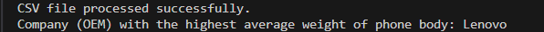
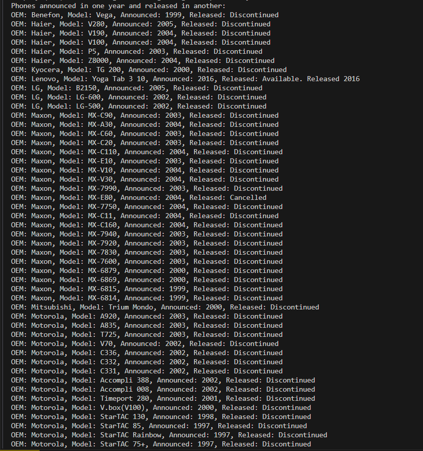
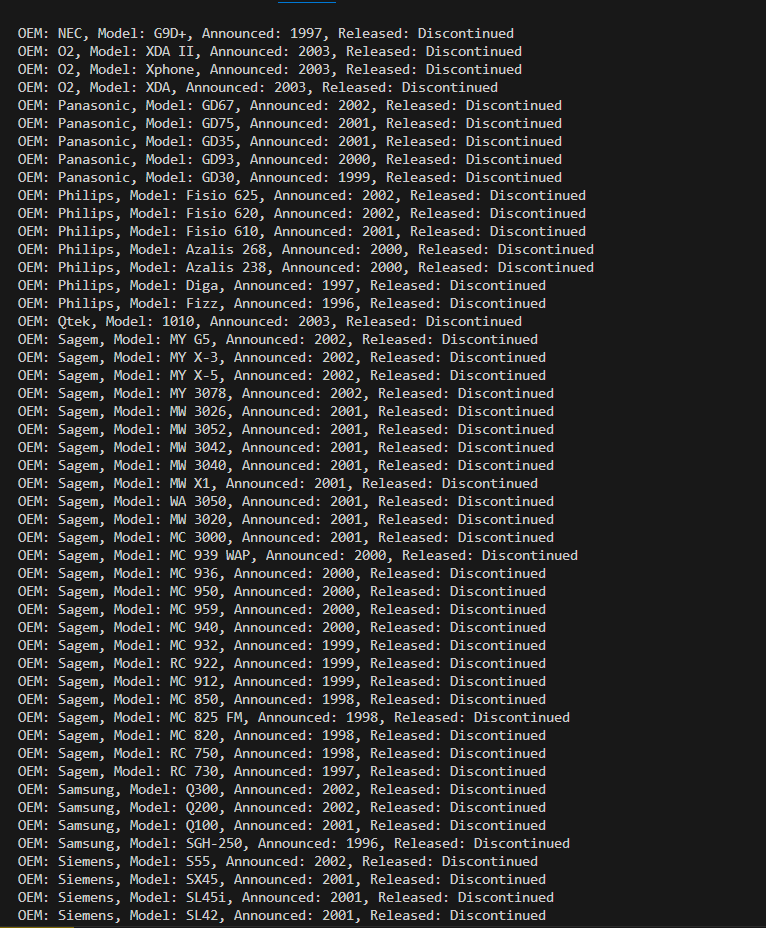
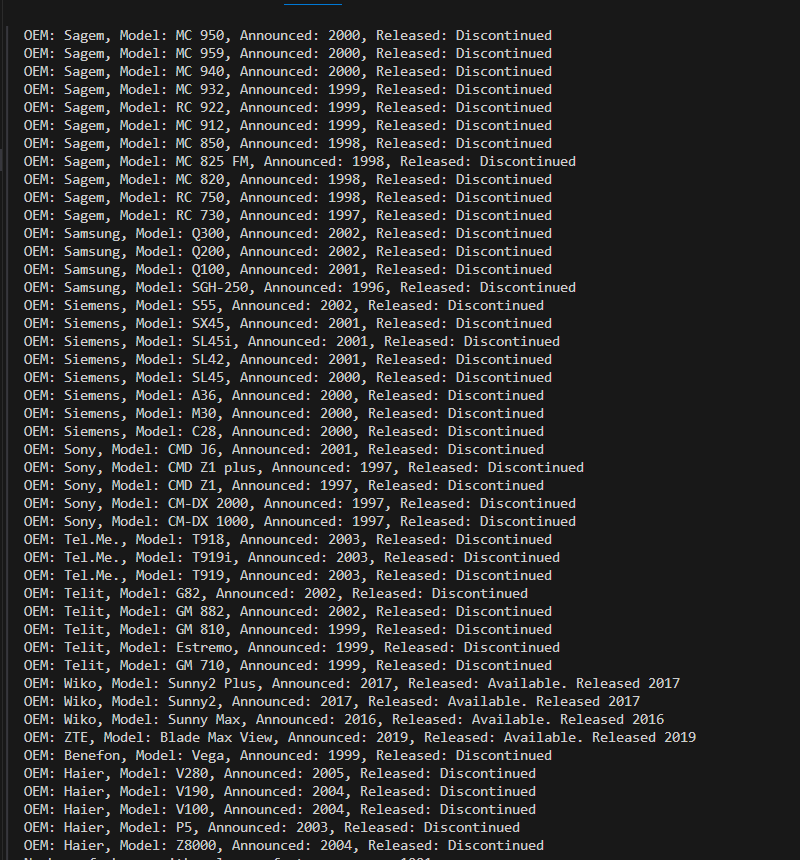

#Which programming language and version did you pick?
JavaScript is the programming language I used , specifically targeting Node.js runtime v20.7.0.

#Why did you pick this programming language?
I chose this programming language because it is great for handling scripting tasks and server-side applications. With Node.js, JavaScript can be used on the server side, which makes it perfect for tasks like working with files, processing data, and managing asynchronous operations.

#How your programming language chosen handles: object-oriented programming, file ingestion, conditional statements, assignment statements, loops, subprograms (functions/methods), unit testing and exception handling. If one or more of these are not supported by your programming language, indicate it as so. 
JavaScript supports OOP concepts through prototypal inheritance and ES6 class syntax. File ingestion is handled using Node.js  module, which provides methods for reading and writing files asynchronously or synchronously. JavaScript supports conditional statements like if, else if, and else for executing different blocks of code based on conditions. Assignment in JavaScript uses the = operator to assign values to variables, properties, or elements of arrays/objects. JavaScript supports various loop constructs including for, while, and for...of loops for iterating over arrays, objects, or other iterable collections. JavaScript functions are defined using the function keyword or arrow functions (() => {}). They can accept parameters, execute code blocks, and return values. JavaScript uses try...catch blocks to handle exceptions and errors gracefully, allowing developers to capture and respond to unexpected runtime issues.

#List out 3 libraries you used from your programming language (if applicable) and explain what they are, why you chose them and what you used them for.
fs (File System) Module, This built-in Node.js module provides methods for interacting with the file system, enabling file reading (fs.createReadStream) and asynchronous file operations. readline Module, Another Node.js module used for reading data from a readable stream (like a file stream) line by line (readline.createInterface), useful for parsing large files efficiently. lodash Library, which is a popular JavaScript utility library that provides many helpful functions for manipulating arrays, objects, and other data structures efficiently. It offers useful functions like forEach, reduce, and sortBy.

#Answer the following questions (and provide a corresponding screen showing output answering them):

#What company (oem) has the highest average weight of the phone body?

#Was there any phones that were announced in one year and released in another? What are they? Give me the oem and models.

#How many phones have only one feature sensor?

#What year had the most phones launched in any year later than 1999? 
